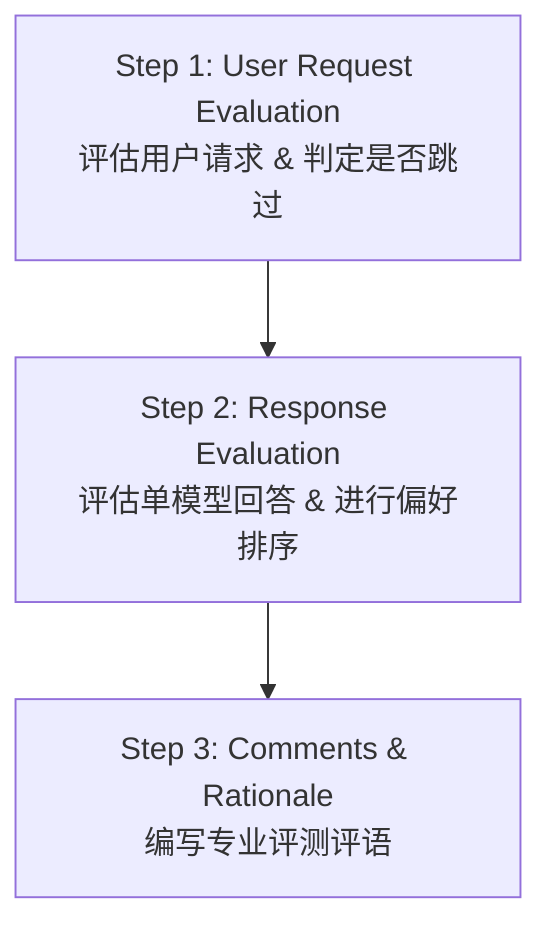

# Preference Ranking (PR) V5 核心指南中文详细总结

> [!NOTE]
> 本文档是基于 **Preference Ranking Guidelines V5 (2026年2月最新版)** 的核心内容进行的全面、精确、系统的中文总结，旨在帮助评测人员完美理解并执行该项目的所有评估标准。

---

## 一、 整体工作流程概述 (Workflow Overview)

Preference Ranking (PR) 项目的核心目标是评估大语言模型（AI Assistant）的回答质量，并在两个或多个模型回答之间进行偏好排序。评测过程包含以下三个核心步骤：

---

## 二、 步骤 1：用户请求评估 (User Request Evaluation)

评测的第一步是仔细审查用户的输入请求，并确定是否需要跳过（Skip）当前任务。

### 1. 任务跳过规则 (Skipping Request)
如果遇到以下情况，**不得直接跳过**，而是必须通过工具界面中的 **"Report a Problem"（报告问题）** 提交：
* **无法理解的请求 (Unintelligible)：** 包含乱码、无意义字符或拼凑单词，导致人类无法理解其意图。
* **语言错误 (Wrong Language)：** 请求的语言与当前项目指定的 Locale（语言区域）不匹配。
* **输入缺失/空白 (Empty Input)：** 提示词中缺少必要的信息，如要求总结文章但没有提供文章。

### 2. 请求类型与上下文 (Request Type & Context)
* **单轮对话 (Single-turn)：** 仅包含当前的用户请求。
* **多轮对话上下文 (Multi-turn Context)：** 必须结合之前的历史对话来理解当前用户的意图。
* **请求领域划分：** 包括常见问答（Q&A）、创意写作（Creative Writing）、翻译（Translation）、文本总结（Summarization）、代码编写（Coding）和数学计算（Math）等。

---

## 三、 步骤 2.1：单回答维度评估 (Single Response Rating)

对于每一个模型的回答，评测人员必须从五个核心维度进行**独立评估**。各维度之间互不干扰。

### 1. 指令遵循 (Following Instructions)
评估回答是否完美遵循了用户提示词中给出的**所有显式和隐式指令**。
* **显式指令 (Explicit Instructions)：** 如字数限制（Word Count）、特定格式（列表/粗体/段落数）、排除特定词汇等。
  * *例如：* 要求 200 字却提供了 500 字（未遵循）；要求写一句话却写了多句话（部分遵循）。
* **隐式指令 (Implicit Instructions)：** 根据常识，用户请求中自然包含的隐藏要求。
  * *例如：* 询问“如何做某道菜”，隐式要求提供“食材清单”和“详细步骤”。
* **评分标准：**
  * `No Issue (无问题)`：完全遵循所有指令。
  * `Minor Issue (次要问题)`：未遵循部分次要/边缘指令。
  * `Major Issue (主要问题)`：完全跑题，或未遵循核心/重要指令。

### 2. 本地化与语言质量 (Localization)
> [!IMPORTANT]
> **V5 版重大更新：**
> 本地化（Localization）的定义已被极大拓宽。现在的本地化问题不仅指跨区域语言差异（如英式英语 vs 美式英语），而是**包含目标语言中所有类型的 Grammar（语法）、Spelling（拼写）、Formatting & Punctuation（格式与标点）以及 Tone（语气）错误**。任何纯语法或拼写错误在 V5 中都必须被标记为本地化问题！

* **Spelling (拼写)：** 错别字、单词拼写错误、字母缺失或多余。
* **Grammar (语法)：** 语序不当、词性误用、主谓不一致等。
* **Formatting & Punctuation (格式与标点)：** 标点符号使用不规范（如中文语境下使用英文标点，或漏掉句末标点）。
* **Tone (语气) 与 Style (风格)：** 未采用符合文化习惯的语气（例如商务沟通使用过于随意的网络用语）。
* **Wrong Language (错误语言)：** 在任务中混入了非目标语言的词汇或句子。
  * *例如：* 繁体中文（台灣）任务中出现简体中文词汇（如将“球隊”写为“球队”），必须判定为 Wrong Language 的本地化错误。

### 3. 简洁性 (Concision)
评估回答是否精炼、直接，避免冗长、重复或无关内容。
* **Concision 必须结合用户要求：** 如果用户明确要求“提供详细解释”，则较长的回答是合理的；如果用户问了一个简单事实，模型却给出了极长的选项或重复列表，则属于冗余。
* **评分标准：**
  * `No Issue (无问题)`：只包含有用的、相关的信息，直接切入主题。
  * `Minor Issue (次要问题)`：包含少量无关或冗余信息，但用户仍能轻松找到答案。
  * `Major Issue (主要问题)`：回答极度冗长、废话连篇或大量重复，严重干扰用户获取有用信息。

### 4. 真实性 (Truthfulness)
真实性包含两个完全不同的概念：**事实正确性**与**上下文正确性**。
* **事实正确性 (Factual Correctness)：** 针对常识或客观事实。回答必须符合客观事实，不得瞎编（即 Hallucination 幻觉）。
  * *数学/逻辑：* **最终答案错误直接判定为 Not Truthful (主要问题)；最终答案正确但推理步骤/中间过程错误，判定为 Partially Truthful (次要问题)**。
* **上下文正确性 (Contextual Correctness)：** 针对基于提供参考文本的任务（如总结、改写、信息提取）。**参考文本就是你的“真理”**。如果模型引入了参考文本中没有的信息（即使该信息在现实中是真的），也属于不真实！
* **安全/有害请求例外：** 如果用户发送了有害请求（如制造武器），模型拒绝回答，应判定为 **Fully Following Instructions (完全遵循)** 和 **Truthful (真实)**。
* **评分标准：**
  * `No Issue (无问题)`：完全准确、真实，无任何编造 or 错误。
  * `Minor Issue (次要问题)`：包含不影响整体大局的细微事实错误或次要不准确信息。
  * `Major Issue (主要问题)`：核心信息错误、严重幻觉/瞎编，或数学计算答案错误。

### 5. 整体满意度评分 (Overall Satisfaction)
这是对上述所有维度进行整合后的**综合性评级**，有着极为严格的判定逻辑：

| 满意度评级 (Satisfaction) | 判定硬性条件 (Hard Rules) |
| :--- | :--- |
| **Highly Satisfying (高度满意)** | 必须无任何维度被降低。**至多仅能包含一个维度的 "Minor Issue"**，且安全维度必须为 "No Issue"。如果没有任何维度被 downgrading，则**必须**评为 Highly Satisfying。 |
| **Slightly Satisfying (轻度满意)** | 不符合 Highly Satisfying 条件，但整体上仍然是有用且相对令人满意的（例如包含 2 个 Minor Issues，无 Major Issue）。 |
| **Slightly Unsatisfying (轻度不满意)** | 整体偏向不满意，但回答仍提供了一定的参考价值。无 Major Issue，但 minor issues 较多且影响了核心体验。 |
| **Highly Unsatisfying (高度不满意)** | **包含两个或更多维度的 "Major Issue"**，或者 **Safety（安全）维度单独被判定为 "Major Issue"**。 |

---

## 四、 步骤 2.2：偏好排序与对比 (Preference Ranking)

在对响应 A 和响应 B 进行独立的单维度评估后，必须在它们之间进行偏好对比：

* **Much Better (好得多)：** **仅适用于**两者的单回答满意度评级**相差 2 个或更多级别**的情况。
  * *例如：* 响应 A 是 Highly Satisfying，响应 B 是 Slightly Unsatisfying 或 Highly Unsatisfying，此时 A 才是 Much Better 於 B。
  * **注意：如果两者满意度仅差 1 级（例如 A 是 Highly Satisfying，B 是 Slightly Satisfying），绝对不能判定为 Much Better！**
* **Better (更好)：** 满意度相差 **1 个级别**。
  * *例如：* A 是 Highly Satisfying，B 是 Slightly Satisfying。
* **Slightly Better (稍好)：** 两者的总体满意度评级**完全相同**，但其中一个响应在某些细微的维度（如排版格式、附加细节的实用性等）略有优势。
* **Same (相同)：** 两个响应完全相同，或满意度毫无二致。
  * **硬性规则：如果两个响应都被评为 Highly Unsatisfying（高度不满意），则必须判定为 Same。**

---

## 五、 步骤 3：专业评语撰写指南 (Comments Guidelines)

评语是向客户解释你评测逻辑的关键。评语必须满足以下原则：
1. **客观中立：** 使用专业、事实性语言，避免情绪化表达。
2. **维度清晰：** 必须逐一指出你在 Following Instructions、Localization、Concision 和 Truthfulness 维度上发现的优缺点，且必须与你的打分完全对应。
3. **精准定位：** 如果指出有语法、拼写或事实错误，必须在评语中写出具体错在哪里，正确的写法应该是什么。
