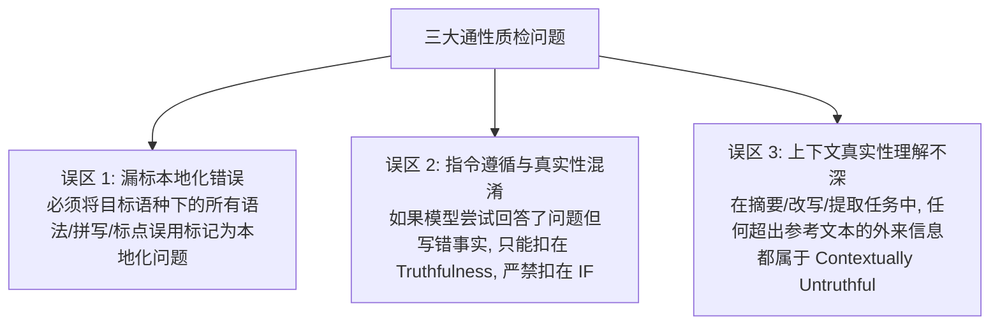

# QA Feedback Master 多语言质检反馈中文总结

> [!NOTE]
> 本文档是基于 **Master PR Feedback (April 2026)** 和 **各语种局部质检反馈** 编写的。它揭示了评测人员在实际打分中最容易犯的通病，并针对您重点关注的 9 个目标语种（AR、HE、HK、MY、TH、TW、VN 等）提供了具体的地方性错误实例与防范准则。

---

## 一、 通性质检防范准则 (General Error Trends & Corrective Actions)

通过对全球各语言评测数据的分析，质检（QA）发现以下三个最普遍的评分错误趋势：

---

## 二、 重点语种区域性评测准则 (Locale-Specific Guidelines)

### 1. 🇦🇪🇸🇦 阿拉伯语 (ar-AE / ar-EG / ar-SA)
* **ar-AE 核心通病：** 
  * 严重遗漏本地化（Localization）错误，并混淆了指令遵循（IF）和真实性（Truthfulness）。
  * *本地化错词实例：* 
    * 拼写错误：`ودﻧﻰ واﻟﻌﺠﻼن` (参与者名字之间多了一个无意义的 `و`)。
    * 语法错误：`ﻣﺼﻤﻤﺎً إﻣﺎراﺗﯿﺎً`（错误的阿拉伯语双格标记，正确应当写作 `ﻣﺼﻤﻤًﺎ إﻣﺎراﺗًﯿﺎ`）。
    * 重复段落：段落首句为 `رﻛﺰ اﻟﻤﺸﺎرﻛﺎت ﻋﻠﻰ ﻣﺰج اﻟﺤﺮﻓﯿﺔ اﻟﺘﻘﻠﯿﺪﯾﺔ` 的整段文字发生了不合逻辑的自我重复，这应当在本地化和简洁性（Concision）同时扣分。
* **ar-EG 与 ar-SA 核心通病：** 
  * 严重过度惩罚指令遵循（IF），同时低估了真实性（Truthfulness）的扣分。
  * *EG 实例：* 用户要求列出 5 道适合消化不良病人的菜肴。模型给出了 5 道菜，但其中几道菜在医学上对胃病患者其实并不安全。
    * **正确判定：** 菜的数量满足了要求，所以 **Instruction Following 是 No Issue (无问题)**；而菜品安全性错误属于事实性错误，**只能且必须扣在 Truthfulness**！
  * *SA 实例：* 
    * 忽略了上下文一致性。参考文本指出窗户是由木头做成的，而模型回答说 `"Nafeza Shebh Khashabeya" (半木制窗户)`。
    * **正确判定：** 使用了“半木制”这个词是不符合原始参考文本的，必须扣在 **Truthfulness**。

### 2. 🇮🇱 希伯来语 (he-IL)
* **核心通病：** 
  * 当文本质量很差时，容易主观地连带判定为指令未遵循。
  * **正确判定：** 哪怕响应中的希伯来语语法极度拗口、文字非常 Awkward，但只要它按照提示词的意图做出了回答并满足了所有格式要求，**Instruction Following 仍必须评为 No Issue**，文字差的问题只应扣在 **Localization** 维度。

### 3. 🇲🇾 马来语 (ms-MY)
* **核心通病：** 
  * 对本地化维度的低级语言错误惩罚不足，漏标严重。
  * *本地化错误实例：* 
    * 不自然的句式：`setiap kanak-kanak teruja dan penuh harapan melihat duit itu`（极度不符合马来语本地人的日常母语书写习惯，显得非常生硬和 Awkward）。
    * 连字符误用：`kerjasama-seluruh-kerajaan`（这个专有名词在马来语中绝对不应该加连字符，属于标点/拼写类本地化错误）。

### 4. 🇹🇭 泰语 (th-TH)
* **核心通病：** 
  * 未上报低级本地化错误，且对真实性（Truthfulness）打分过高（放水严重）。
  * *本地化错误实例：* 出现极度不自然的缩写 `ชลบ.`，当地人完全不会使用这种非标准缩写，必须在 **Localization (Other)** 标记扣分。
  * *IF 与 Truthfulness 混淆实例：* 提示词要求从文中提取句子并分类到四个不同的群组中。模型完美提取并进行了分类，但将几句话放错了分类组。
    * **正确判定：** 分类错误属于事实匹配错误，扣在 **Truthfulness**；提取并分类这个“动作”模型已经做了，所以 **Instruction Following 不能扣分**。

### 5. 🇻🇳 越南语 (vi-VN)
* **核心通病：** 
  * 严重低估（underpenalizing）了指令遵循和本地化的错误。
  * *指令遵循漏标实例：* 提示词明确要求用“破折号 (dashes)”来列出条目，但大模型却使用了“圆点/项目符号 (bullet points)”。这是一个显式格式指令的违背，必须在 **Instruction Following (Minor Issue)** 扣分。
  * *本地化漏标实例：* 越南语回答中直接夹杂了未经翻译的英文词汇 `low carb` 和 `carbohydrate`。在纯越南语语境任务中出现外来夹杂，**必须在 Localization (Wrong Language) 扣分**。

### 6. 🇭🇰 繁体中文 - 香港 (zh-HK)
* **核心通病：** 
  * 忽略本地化维度的中港词汇混用，并且过度惩罚指令遵循。
  * *本地化书面语混用实例：* 
    * 香港繁体任务中出现了口语与书面语的严重混杂，例如使用了 `不一樣`，这在香港正规繁体书面语中显得十分生硬（應使用 `不同` 或 `各有不同`），必须在 **Localization (Awkward or Unnatural Writing)** 扣分。
  * *IF 与 Truthfulness 混淆实例：* 用户要求为 4 天的香港之旅提供行程规划。模型提供了 4 天的活动，但其中一些景点的开馆时间或地点被模型“幻觉”写错了。
    * **正确判定：** 行程规划做足了 4 天，所以 **Instruction Following 是 No Issue**；景点事实写错只应当扣在 **Truthfulness**。

### 7. 🇹🇼 繁体中文 - 台湾 (zh-TW)
* **核心通病：** 
  * 对繁体中文的“台湾地区日常用词规范”和“语法通顺度”把关不严。
  * *本地化错误实例：* 
    * 简体字/大陆词汇混入 (Wrong Language)：在台湾繁体任务中，大模型输出了带有大陆语法习惯的表达方式。例如将台灣常用的“球隊…進攻策略”直接混入或混用了大陆习惯词汇，必须在 **Localization (Wrong Language)** 扣分。
    * 生硬拗口的句式 (Awkward Writing)：例如直接输出 `更多地強調`，极其不符合台灣國語的在地日常表達習慣（台灣人更習慣使用 `更加強調` 或 `著重於`），必须在 **Localization (Awkward or Unnatural Writing)** 标记扣分。
