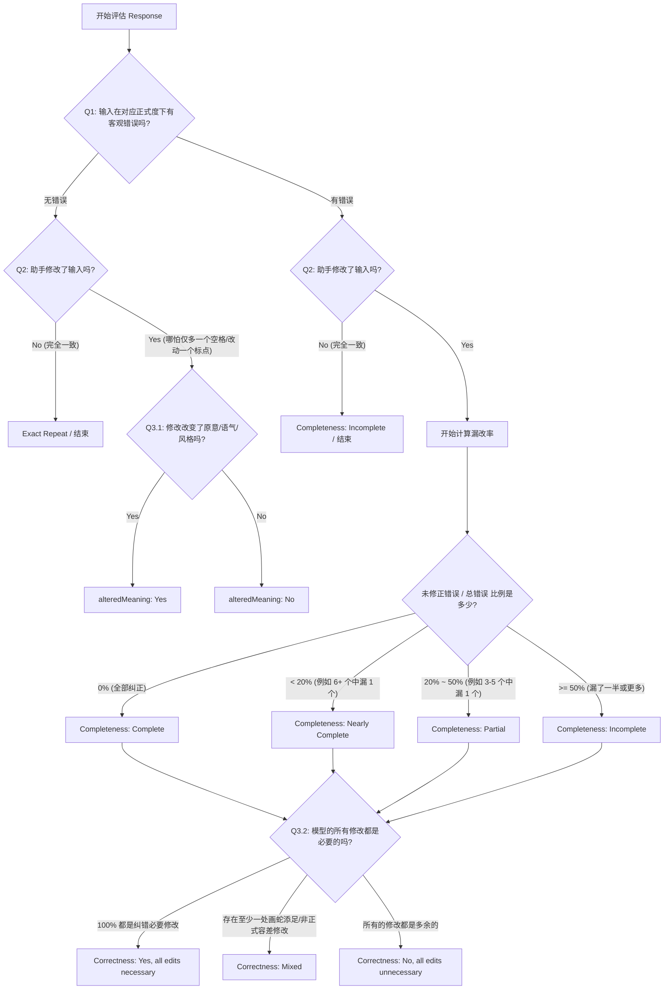

# Writing Tools - WT Proofread V2 Feedback (May 22) 中文详细总结

本总结针对 2026 年 5 月 22 日发布的官方 **WT Proofread V2 Feedback & Calibration** 指南进行深度提炼，系统整理了核心错误趋势、根本原因分析、高精度的严重度校准量化指标，以及 CJK（特别是简体中文 `zh_CN`、香港粤语 `zh_HK`、台湾繁体 `zh_TW`）Locale 的官方实战判罚案例。本手册旨在为校对任务提供最权威的黄金裁判标准。

---

## 一、 文档背景与核心校准目标

官方通过对多语种（特别是中文、日文、韩文和越南语）的评级数据进行审计，发现评级人员在 Completeness（完整性）、Correctness（正确性/修改必要性）和 Pairwise Comparison（成对比较）三个核心维度上存在严重的不一致性。

### 核心改进目标：
1. **统一严重度分级标准**：将 Completeness 和 Correctness 转化为严格量化的判定流程。
2. **规范非正式文本（Informal/Other）的容差尺度**：避免过度惩罚非正式语境下的标点、大小写和空格瑕疵。
3. **消除微小变动的漏判**：在 Q2 中严格识别哪怕只有一个空格、标点或大小写变动的 Response。

---

## 二、 主要错误趋势与根本原因分析 (RCA)

评级人员最常犯的错误集中在以下几个方面：

| 维度 | 常见错误表现 | 官方定位根本原因 (RCA) | 校准行动方案 |
| :--- | :--- | :--- | :--- |
| **Completeness** (完整性) | 经常漏看输入文本中模型未捕获 of 错误，将本应评为 `nearly_complete` 或 `partial` 的响应高评为 `complete`。 | 评级人员在校对响应时，假设模型已经找出了大部分错误，未仔细研读原始输入。 | **先读懂输入**：在评估响应前，必须专注、逐字阅读原始输入，独立列出所有客观错误，绝不盲信模型。 |
| **Correctness** (正确性/修改必要性) | 对修改必要性（Edit Necessity）的判定尺度不一： 1. 将包含不必要修改的响应误判为 `all_necessary`； 2. 对非正式文本中的合理标点/空格修改进行过度扣分。 | 评级人员对**正式度（Formality）**与**最小编辑原则（Minimal Edit Principle）**的结合理解不深，未能区分不同语境下的规范要求。 | **正式度锚定**：根据输入文本的 Formality 级别判定修改是否必要。在**非正式**文本中，标点、大小写、空格的变动若不改变原意，皆为**不必要修改**。 |
| **Pairwise** (成对比较) | 两个响应质量完全相同（如同等 Completeness 和 Correctness）时强行比出高下；或在质量有轻微差距时误判为 `about the same`。 | 未能将 Completeness 和 Correctness 的单项评分作为成对比较的最终决策依据。 | **单项级联原则**：成对比较必须以两个响应的 Completeness 和 Correctness 评级作为底色。评级相同且质量相当时，果断判定为 `about the same`（响应文本无需完全相同）。 |
| **Q1 (Grammar)** | 将含有客观错误的输入文本误判为 `No errors`。 | 忽视了正式度语境，或对隐蔽的语义矛盾、方言规范不敏感。 | 严加研读，注意区分方言标准（如粤语）与错别字。 |
| **Q2 (Changes)** | 在响应与输入存在微小空格、标点或大小写变动时，误判为 `No, the response is identical`。 | 评级人员用肉眼快速扫视时，容易忽略极其细微的格式变化。 | **逐字Diff比对**：只要响应与输入有任何一处不同（哪怕是全半角符号转换或多了一个空格），必须选择 **Yes, the response is different**。 |

---

## 三、 严重度校准黄金准则 (Severity Calibration)

### 1. Completeness (完整性评分量化百分比)
Completeness 的判定不再依赖主观感受，而是根据**漏改率（未修正错误占总客观错误的比例）**进行精确计算：

*   **Complete (完全完成)**：响应精准纠正了输入中**所有**在当前正式度下必须修改 of 客观错误，且符合最小编辑原则。
*   **Nearly Complete (近乎完成)**：响应漏掉了**极少数**错误，量化标准为**漏改率 $< 20\%$**。
    *   *数学模型*：当输入中存在 6 个、7 个、8 个或更多客观错误时，模型仅漏改了其中的 **1 个**。
*   **Partial (部分完成)**：响应漏掉了**显著部分**的错误，量化标准为**漏改率在 $20\%$ 至 $50\%$ 之间**。
    *   *数学模型*：当输入存在 3 个、4 个或 5 个客观错误时，模型漏改了其中的 **1 个**；或在更多错误中漏改了多处。
*   **Incomplete (未完成)**：响应漏掉了大部分或全部错误，量化标准为**漏改率 $\ge 50\%$**（漏掉了一半或更多的错误）。

### 2. Correctness & Edit Necessity (正确性与修改必要性)
*   **Yes, all edits are necessary (全部修改均有必要)**：响应所做的每一次修改，在当前正式度与最小编辑原则下都是完全必须的（即为了纠正客观错误，不含任何修饰性、润色性改动）。
*   **Mixed (混合/存在不必要修改)**：响应中做出的修改，**只要有至少一处（哪怕仅有一处）是不必要的，整个 Correctness 评级必须降级为 Mixed**。
*   **No, all edits are unnecessary (全部修改均不必要)**：响应做出的所有修改均无必要。

> [!IMPORTANT]
> **非正式文本（Informal/Other）标点与空格容差法则：**
> 在日常聊天、社交媒体发言等非正式输入中，标点缺失、大小写不规范、缺少句末句号、多余空格等瑕疵**是完全可接受的（Acceptable）**。
> *   **Q1 判定**：此类非正式输入应被判定为 **No errors**（无语法错误）。
> *   **Correctness 判定**：如果模型在响应中主动“修复”了这些不影响语义的标点、大小写或空格，且没有改变原意：
>     *   这些修改在非正式语境下被定义为**不必要修改（Unnecessary Edits）**。
>     *   因此，该 Response 的 Correctness **必须判定为 Mixed**，并在 `unnecessaryEdits` 数组中勾选相应的 `punctuation`、`capitalization` 或 `spacing`！

### 3. Pairwise Comparison (成对比较校准)
*   **About the same (基本一致)**：两个响应的 Completeness 和 Correctness 最终评级完全相同。
    *   *极重要校准*：**两个响应不需要完全一致（not identical）**！即使它们修改的具体词汇或选用的句式不同，只要它们在 completeness 和 correctness 维度上展现出相同的技术水准且均可接受，就必须评为 `About the same`。
*   **Slightly better (稍微更好)**：两个响应的单项评分非常接近，但其中一个在某一个维度上稍有优势（例如：A 纠正了所有错误，B 漏掉了一个极微小的标点错误；或者 A 没有任何不必要修改，B 引入了一处极微小的不必要空格修改）。
*   **Much better (好得多)**：两个响应在 Completeness 或 Correctness 上存在明显的级别差距（例如：A 是 Complete，B 是 Partial；或 A 是 All Necessary，B 引入了大量篡改原意的严重错误修改）。

---

## 四、 CJK Locale 专项校准与实战案例

### 1. zh_CN (简体中文)

#### 案例 A：语序调整的必要性判别 (Edit Necessity: All Necessary)
*   **输入 (Input)**：`亲爱的，刚开始健身的话，先从简单的拉深做起就行，别用力过猛一上来就。`
*   **响应 (Response)**：`亲爱的，刚开始健身的话，先从简单的拉深做起就行，别一上来就用力过猛。`
*   **分析与评级**：
    *   输入中的句尾短语 `别用力过猛一上来就。` 存在严重的中文语序混乱，阻碍了句意流畅度。
    *   响应将其调整为符合简体中文语法习惯的 `别一上来就用力过猛。`。
    *   **判定**：此项语序调整是完全必要的客观纠错。由于没有做任何其他润色，修改必要性判定为 **Yes, all edits are necessary**。

#### 案例 B：语义矛盾/别扭句子的漏改判定 (Completeness: Nearly Complete)
*   **输入 (Input)**：`小琳，咱们，原定2024-10-25，晚上19:00的聚餐，还算术吗？我刚订好位子，但还没订到，等你回复哦！`
*   **响应 (Response)**：`小琳，咱们原定2024-10-25晚上19:00的聚餐，还算数吗？我刚订好位子，但还没订到，等你回复哦！`
*   **分析与评级**：
    *   输入中包含多处错误：
        1. 标点多余：`咱们，` 和 `2024-10-25，` 处的逗号切断了时间链条，多余。
        2. 错别字 typo：`还算术吗` 应为 `还算数吗`。
        3. **严重语义矛盾**：`我刚订好位子，但还没订到` 逻辑前后完全矛盾（“刚订好”与“还没订到”冲突），属于明显的病句/语义逻辑错误。
    *   模型响应成功去掉了多余逗号，并将 `算术` 修正为 `算数`；但**完全漏掉了**对语义前后矛盾病句 `订好位子，但还没订到` 的修正。
    *   **判定**：由于模型漏掉了这个明显的语义错误（在总共 5-6 处需要修正的错误中只漏了这 1 处，漏改率 $< 20\%$），Completeness 判定为 **Nearly complete**。

---

### 2. zh_HK (香港繁体粤语)

香港粤语具有极强的本地化方言规范和特定的错字、混用字判罚标准。

#### 案例 A：方言字与标准语序修正 (Edit Necessity: All Necessary)
*   **输入 (Input)**：`喂，純粹喺我既意見，唔代表我哋公司立埸。你係不是講咗嗰個姓梁嘅KOL？嗰個根本就係靠煽動情緒嚟呃like。搵咗少少嘢就無限放大，其實無材料，正一神棍。`
*   **响应 (Response)**：`喂，純粹喺我嘅意見，唔代表我哋公司立場。你係咪講咗嗰個姓梁嘅KOL？嗰個根本就係靠煽動情緒嚟呃like。搵咗少少嘢就無限放大，其實無材料，正一神棍。`
*   **分析与评级**：
    *   模型做出了以下修改：
        1. 粤语所属格代词纠正：将 `我既意見` 纠正为粤语正字 `我嘅意見`（必要）。
        2. 笔画 typo 纠正：将 `立埸` (yì) 纠正为 `立場` (chǎng)（必要）。
        3. 书面/方言混用纠正：将 `你係不是` (粤语 `係` 与官话 `是不是` 混用) 纠正为地道的粤语方言问句 `你係咪`（必要）。
    *   **判定**：模型所做的这三处修改都是完全必要且正确的，符合香港粤语的本地化规范，无任何过度修饰。修改必要性判定为 **Yes, all edits are necessary**。

#### 案例 B：香港本地化介词混用漏改 (Completeness: Nearly Complete)
*   **输入 (Input)**：同上 (`喂，純粹喺我既意見...`)
*   **响应 (Response)**：同上 (`喂，純粹喺我嘅意見...`)
*   **分析与评级**：
    *   除了上述纠正的三处错误外，输入中其实还残留了一个非常隐蔽的香港粤语字词误用：
        *   首句 `純粹喺我既意見` 中的 **`喺`** ❌。
        *   *粤语语义学*：`喺` 相当于官话中的 "在" (at/in)，而此处语义为 "是" (is/am/are)，在粤语中必须写作 **`係`**  (即 `純粹係我嘅意見` 才是 100% 正确的粤语语法)。
    *   响应保留了错误的 `喺`，未将其修改为 `係`。
    *   **判定**：模型漏改了这 1 处介词误用。在总共 5-6 处客观错误中仅漏改此 1 处（漏改率 $< 20\%$）。因此，Completeness 判定为 **Nearly complete**，未修正错误类别 `missedErrors` 需勾选 `poor_word_usage`。

---

### 3. zh_TW (台湾繁体中文)

台湾繁体中文对代词冗余、简繁转换以及极细微的排版符号和空格有着严苛的标准。

#### 案例 A：冗余代词与繁体字修正 (Edit Necessity: All Necessary)
*   **输入 (Input)**：`你看那條河，几十年前我小時候還可以在裡面玩水欸。現在喔...唉，整個都便色了。人類就是這樣，取之於自然 → 卻不懂的珍惜。這真是太SAD了，希望你長大後不會變成這樣的大人。`
*   **响应 (Response)**：`你看那條河，幾十年前我小時候還可以在裡面玩水欸。現在喔...唉，整個都變色了。人類就是這樣，取之於自然 → 卻不懂得珍惜。這真是太SAD了，希望你長大後不會變成這樣的大人。`
*   **分析与评级**：
    *   模型做出了以下繁体中文校对：
        1. 简繁转换修复：将简体字 `几十` 修正为繁体 `幾十`（必要）。
        2. typo 纠正：将错字 `便色` 纠正为 `變色`（必要）。
        3. 助词语法纠正：将 `不懂的珍惜` 纠正为符合副词修饰动词规范的 `不懂得珍惜`（必要）。
    *   **判定**：所有修改皆为繁体中文语法和字形的硬性修正，无任何词汇润色。修改必要性判定为 **Yes, all edits are necessary**。

#### 案例 B：微小格式与空格改动的 Q2 判定 (Q2 Assistant make changes: Yes)
*   **输入 (Input)**：`學長，我這幾天在研究我們的便當推薦系統，發現API回應速度有時候真的很慢。我在想，如果導入像是「redis"的快取機制，效能應該能提升不少？...您方便時能幫我看看給點建议吗？`
*   **响应 (Response)**：`學長，我這幾天在研究我們的便當推薦系統，發現 API 回應速度有時候真的很慢。我在想，如果導入像是「redis」的快取機制，效能應該能提升不少？...您方便時能幫我看看給點建議嗎？`
*   **分析与评级**：
    *   模型响应做出了以下极细微的排版与字符调整：
        1. **中英空格**：在英文单词 `API` 前后插入了半角空格，变为 ` API 回應`。
        2. **成对标点符号**：将输入中不对称的引号 `「redis"` 修正为成对的繁体中文引号 `「redis」`。
        3. **简繁转换**：将句尾的简体字 `建议吗` 修正为繁体 `建議嗎`。
    *   **判定**：虽然前两项（加空格、改引号）改动极其微小且属于格式调整，但只要响应与输入在字符层面有任何差异，Q2 的判定**绝对不能选 No**，必须毫不犹豫地选择 **Yes, the response is different**（助手修改了输入）。

---

### 4. 日韩 Locale 核心差异要点 (ja_JP / ko_KR)

为了保持多语种评级的全局视野，以下两点必须掌握：

*   **韩文 (ko_KR) 非正式文本容差案例**：
    *   输入：`이게 다아? 왜 너를 조아하는거지?` (日常极非正式聊天)
    *   响应：将空格瑕疵 `조아하는거지` 修改为了标准空格 `조아하는 거지`。
    *   **判定**：在 Informal 语境下，`조아하는거지` 的空格错误是完全可接受的。模型的主动修复属于 **Unnecessary Edits**，因此 Correctness 必须被降级为 **Mixed**！
*   **日文 (ja_JP) 正式度与语气判定**：
    *   在日文半正式（Semi-formal）语气下，保留 `〜と考えてます` 是完全正确的，如果模型强行将其“标准化”为更生硬的 `〜と考えています`，且无其他必要修改，则该修改属于不必要修改，Correctness 同样需判为 **Mixed**。

---

## 五、 终极实操避坑思维导图与工作流

在做题时，请严格将本反馈中的量化指标灌注到你的判定逻辑中：

---

> [!TIP]
> **黄金裁判复核清单：**
> 1. **不要放过任何微小的 Diff**：Q2 中只要有字符差异，一律判定为 `different`！
> 2. **量化 Completeness**：先用草稿纸数清输入文本中一共有多少处必须修改的错误，然后数模型漏改了几处。严格按照 `<20%` (Nearly)、`20%-50%` (Partial) 和 `≥50%` (Incomplete) 划分，绝不凭感觉。
> 3. **极简主义 Correctness**：凡是模型在 `Other` (非正式) 语境下修改了空格、不影响语义的标点、大小写的，Correctness 必须打上 **Mixed** 烙印！
