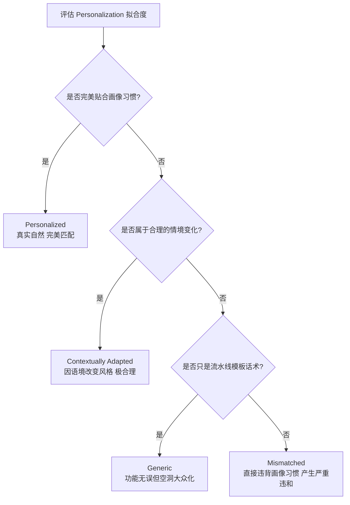

# Writing Tools - Mail Smart Replies Guidelines v1.3 中文详细总结

> **文件来源**：`Writing Tools - Mail Smart Replies Guidelines v.1.3 [Updated May 4].pdf`  
> **核心任务**：评估针对电子邮件场景生成的智能候选回复（Mail Smart Reply, MSR）的质量，涵盖 5 个通用质量维度和 1 个个性化维度。

---

## 1. 任务概述与工作流 (Overview & Workflow)

**Mail Smart Reply (MSR) 邮件智能回复**旨在帮助用户高效撰写电子邮件草稿。当用户回复现有邮件或撰写新邮件时，系统会基于其历史沟通模式生成个性化、自然且契合语境的完整邮件草稿。

### 核心评估工作流
 MSR 评测遵循以下 7 个基本步骤：
1. **Step 1 - 审核输入 (Review Input)**：理解对话上下文、提示词（Prompt）、生成日期和原邮件。
2. **Step 2 - 评估有害性 (Harmfulness)**：判定候选回复是否包含敏感、违法或不安全内容。
3. **Step 3 - 审核邮件主题 (Verify Subject)**：核对新撰写邮件主题的规范性。
4. **Step 4 - 评估候选回复通用性质 (Evaluate Generic Qualities)**：对 5 大通用指标进行打分。
5. **Step 5 - 查看用户画像 (Review User Profile)**：细致审核发送者的习惯（词汇、格式、标点等）。
6. **Step 6 - 评估个性化还原度 (Evaluate Personalization)**：判定生成内容是否完美匹配用户风格倾向。
7. **Step 7 - 双系统对比 (Compare Responses)**：完成最终的两两偏好排序（Pairwise Comparison）。

---

## 2. 邮件主题规范 (Step 3: Email Subject Verification)

一个优秀的邮件主题必须**同时满足**以下 6 项标准（若完全符合，则在评估中全部勾选）：

| 序号 | 标准 | 规范要求与示例 |
|:---:|---|---|
| **1** | **主题词 + 动名词格式** | 必须采用 `Topic + Nominalized Action` 结构，避免使用介词短语（如 to, for, on, about, of 等）。 • **✅ 合格**："Meeting Cancellation", "Budget Approval", "Potluck Invitation" • **❌ 不合格**："Invitation to Potluck", "Request for Budget Approval", "Timeline for Launch" |
| **2** | **使用 Title Case（标题大小写）** | 遵守芝加哥格式（首尾词大写，所有实词首字母大写）。 • **✅ 合格**："Team Outing Location", "New Hire Orientation" • **❌ 不合格**："Team outing location" (句首大写), "TEAM OUTING" (全大写) |
| **3** | **无末尾标点和表情** | 结尾绝不能带有句号、问号、叹号或 Emoji。 • **✅ 合格**："Meeting Reschedule" • **❌ 不合格**："Meeting Reschedule!", "Team Update 🥳", "Please Respond..." |
| **4** | **适度概括 (Omit Extra Details)** | 传达核心意图，但过滤掉时间、地点、日期等冗余细节，同时避免空洞词汇。 • **✅ 合格**："Q3 Sales Report", "Marketing Budget Review" • **❌ 太细**："Potluck Rescheduled to Monday at 5pm" • **❌ 太泛**："Latest Numbers", "Update", "Important Info" |
| **5** | **仅表达单一核心意思** | 只能包含一个中心主题，避免使用 `and` 等连词进行双核拼凑。 • **✅ 合格**："Project Update", "Expense Approval" • **❌ 不合格**："Project Update and Budget Review", "Meeting Invite and Action Items" |
| **6** | **客观中立 (No Hype/Subjective)** | 严禁使用带有营销色彩、夸大或主观的词汇（如 Exciting, Amazing, Urgent, Special 等）。 • **✅ 合格**："New Product Launch", "Sunday Event Invitation" • **❌ 不合格**："Incredible New Product Launch!", "Join Us for an Exciting Event!" |

> [!TIP]
> **特殊免审场景**：
> - 如果任务中**完全没有生成**邮件主题，或者用户是在**直接回复**一封现有的历史邮件（已自带主题），则应在界面中勾选对应的“跳过主题审核”选框。

---

## 3. 5 大通用评估维度 (Step 4: Generic Quality Dimensions)

每个通用维度都必须**完全独立地进行判定**。即便一个回复捏造了事实，它仍可能具有很高的个性化程度。

### 维度一：事实关联性/基于原文 (Groundedness)
评估生成内容是否完全基于已知上下文（Prompt、历史邮件、附加信息及画像），**严防多余话题和未证实的动作细节（幻觉）**。MSR 在此维度采用全新的**三档标尺**：

1. **Grounded（完全基于原文）**：
   - 所有的内容都能在源数据中找到依据，或者属于**合理的常规延展**。
   - **普通职业客套话与寒暄语**（如 "Hope you are doing well", "Thanks for checking in", "Best regards"）一律视为 Grounded，严禁扣分！
   - 根据邮件性质进行的**常规社交框架话术**（如后采访感谢信中说 "It was a wonderful conversation"）视为 Grounded。
2. **Partially Grounded（部分基于原文 - 核心无误但带轻微幻觉）**：
   - 回复的核心意图与指令完全对齐，但**掺杂了微小的、不改变核心意思的虚构细节**。
   - **Rule 1（未证实的具体实体）**：提到具体的未证实时间、具体时长、特定未证实的地点/人名。例如，Prompt 仅写“安排早午餐”，回复写 "schedule brunch at Riverside Bistro at 11am"（Riverside Bistro 和 11am 无法证实） $\rightarrow$ 判定为 **Partially Grounded**。
   - **Rule 5（未证实的收件人姓名）**：如果输入的任何位置（Prompt、历史邮件、画像）都完全找不出收件人名字，但回复开头却使用了具体姓名（如 "Hi Emily,"），只要核心意思正确，一律判定为 **Partially Grounded**（绝非 Not Grounded）。
3. **Not Grounded（未基于原文/严重幻觉）**：
   - 引入了完全无关的新话题、捏造了改变核心事实的动作（如 "I have already scheduled the meeting" 实际上并没有安排）、或者包含明显不切实际的离谱建议（如没有天气预案直接要求去户外野餐，或要求当天进行跨国出差 $\rightarrow$ **Rule 3 实用性判定**）。

---

### 维度二：指令遵循与上下文适配 (Instruction Adherence & Contextual Fit)
评估模型是否完全执行了 Prompt 中的要求，并与历史邮件上下文顺畅对接。采用**三档标尺**：

*   **Followed and Fit（完全遵循与适配）**：
    - 精确完成了 Prompt 中所含的所有要求，并对历史邮件的核心内容、提问给予了完全、恰当的响应。
    - 语气、语调和正式程度与当前会话语境完全对齐。
*   **Partially Followed and Fit（部分遵循与适配）**：
    - **遗漏次要指令**：完成了主要任务，但漏掉了 Prompt 中附带的次要细节。
    - **不完美的上下文响应**：回应了先前邮件中的绝大部分关键点，但遗漏了其中某个小问题。
    - **轻微的正式程度错配**：例如内部邮件交流中，语气显得稍微过分正式或稍微偏随意，但未产生严重隔阂。
*   **Not Followed or Misfit（未遵循或不适配）**：
    - 遗漏了 Prompt 中的核心关键指令，或给出的回复与指令要求**直接对立/矛盾**。
    - 完全无视历史邮件中的提问，直接转移话题。
    - 出现**严重的正式程度级别错配**（如在正式、严肃的客户或上级线程中，使用了极度轻浮、随意的用词）。

---

### 维度三：语调与同理心适配 (Tone & Empathy Alignment)
评估回复的感官语调是否与人际关系（Relationship Label）和收件人当下的情感状态完美匹配。

*   **Aligned（语调适配）**：
    - 语气完全符合人际关系规范（如 Transactional label 下保持礼貌温和的商业语调，Friends label 下保持熟稔轻松的语气）。
    - 面对收件人的情绪（如愤怒、沮丧、兴奋、悲伤），回复中使用了**恰当的主动同理心或情绪共鸣表达**（如 "I'm so sorry to hear about the delay"）。
*   **Not Aligned（语调不适配）**：
    - 回复表现得过于冷漠、机械或缺乏起码的人性温度（例如客户反馈键盘物流一直显示 processing 且表示非常 frustration 时，回复仅冷冰冰地告知 "We are investigating the status" $\rightarrow$ **典型的不适配案例**）。
    - **注**：在上下文及关系不清晰时，应秉持谨慎原则，**优先偏向于选择展示同理心与礼貌**的候选。

---

### 维度四：自然度 (Naturalness)
评估回复是否流畅，是否像由真正的母语者亲笔撰写。

*   **Natural（自然）**：
    - 语言顺畅，无生硬、蹩脚或怪异的句式。
*   **Unnatural（不自然）**：
    - 充满明显的“机器翻译腔”或公式化的生硬套话（例如："Your request has been received. The requested metrics will be delivered by tomorrow." $\rightarrow$ 极其死板、机械，非真人封口习惯）。

---

### 维度五：本地化 (Localization)
评估候选回复在语法、书写习惯、日期、度量衡、标点符号等方面是否完全融入目标 Locale 的地理文化习惯。
- 对于 **zh-CN (简体中文)** 和 **zh-HK (繁体中文)** Locale，本地化属于 **HIGH RISK（高风险维度）**。评测中必须以最高标准挑剔排查！
- **高频扣分项**：中英文标点混用（如中文句子里出现半角逗号 `,` 或英文问号 `?`）、简繁体字转换遗留、日期/度量衡格式未转化为本地习惯。
- **注意**：Grammar (语法错误) 和 Spelling (拼写错误) 不属于 Localization，应在各自的维度反馈，不要把纯语法错勾选为 Localization 问题。

---

## 4. 2 大用户画像与个性化维度 (Steps 5 & 6)

### 用户画像 (User Profile) 的四大构成
Grader 必须点开 "Show Profile" 检查用户的独有习惯：
1.  **Writing Style Patterns**：包括 Vocabulary Level（词汇级别：Basic, Advanced, Technical）、Formatting（如倾向于 bullet points 还是 plain paragraphs）、Padding（表达倾向于 direct 还是 softer balanced padding）、Sentence Structure（ Segmented 短句还是 Balanced 长短交错）。
2.  **Grammar / Punctuation**：叹号、逗号的使用频率和特色。
3.  **Mail Component Patterns**：Address Forms（称呼用语倾向）、Salutations（ greeting 习惯如 Hi, Hey）、Openings（开场白习惯）、Closings（结尾寒暄）、Sign-offs（落款，如 Thanks, Best）、Signatures（签名习惯：全名、名或首字母）。
4.  **Speech Level**（仅适用于 ja_JP 和 ko_KR）：敬语与非敬语级别。

### 个性化 (Personalization) 四档判定标准

个性化打分绝对不能与 Groundedness 混为一谈，它是针对**风格拟合度**的专项考核：

*   **1. Personalized（个性化）**：
    - 完美融入了用户画像中的所有高频特征。如果用户画像是 `strong_formatting`，回复就完美地使用了列表；开场白、落款和签名（如 `Thanks vs Thank You` 细节）与画像中的习惯百分百契合，读起来就觉得是此人亲笔。
*   **2. Contextually Adapted（因地制宜/语境适配）**：
    - 模型**主动偏离**了画像中的高频特征，但这种偏离在当前社交场景下**极度合理**。例如，用户画像在 90% 的情况下非常 casual，但这次发件的对象是他的 manager 或者是为了处理一桩敏感危机事件，草稿自动变得非常 formal 且严谨。这属于顶级个性化表现。
*   **3. Generic（泛泛/模板化）**：
    - 回复虽然语义和指令完全正确，但**没有任何个性的佐料**，读起来像是一个纯粹的机器模板。例如，漏掉了用户的个性落款，把画像中一贯要求的 bullet points 抹平为普通段落。
*   **4. Mismatched（风格错配/严重违和）**：
    - 生成的文字**无理由地直接违背了画像的底层习惯**，导致了人设崩塌。例如，用户平时只用极简词汇，草稿中突然塞入大量极度学术的 technical jargon；或用户从来不用格式，模型却无缘无故地排版了一大堆加粗和列表。
